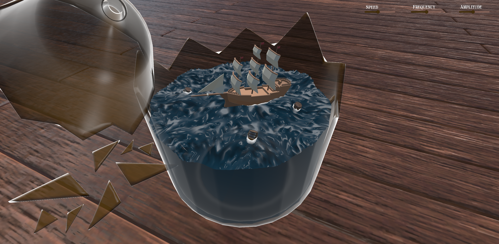
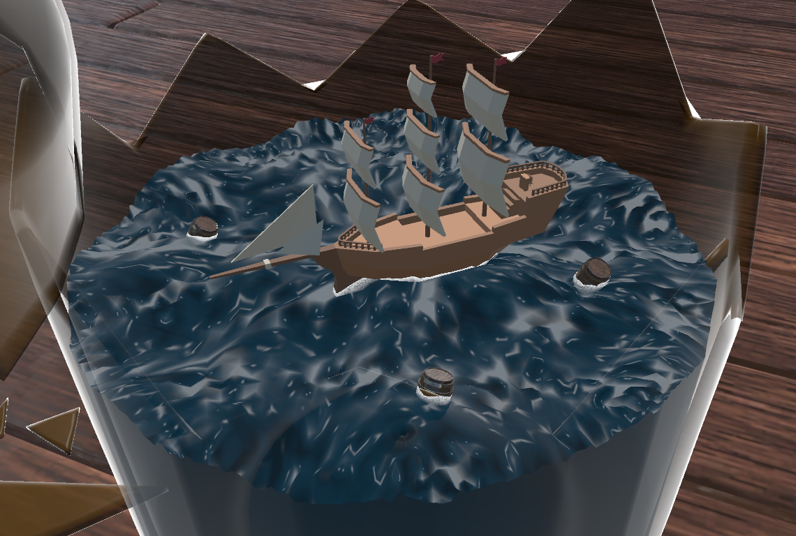
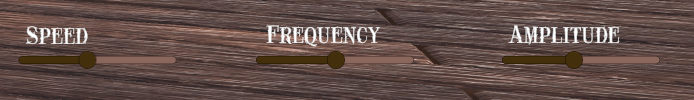
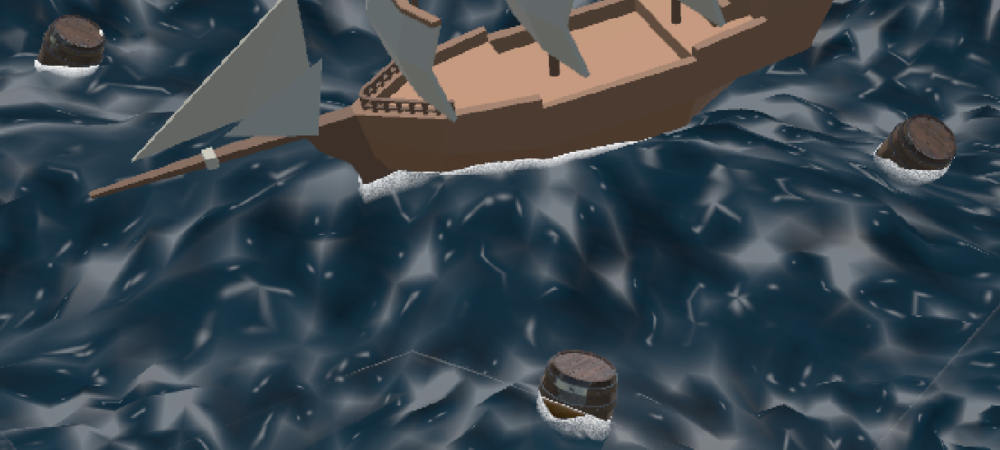
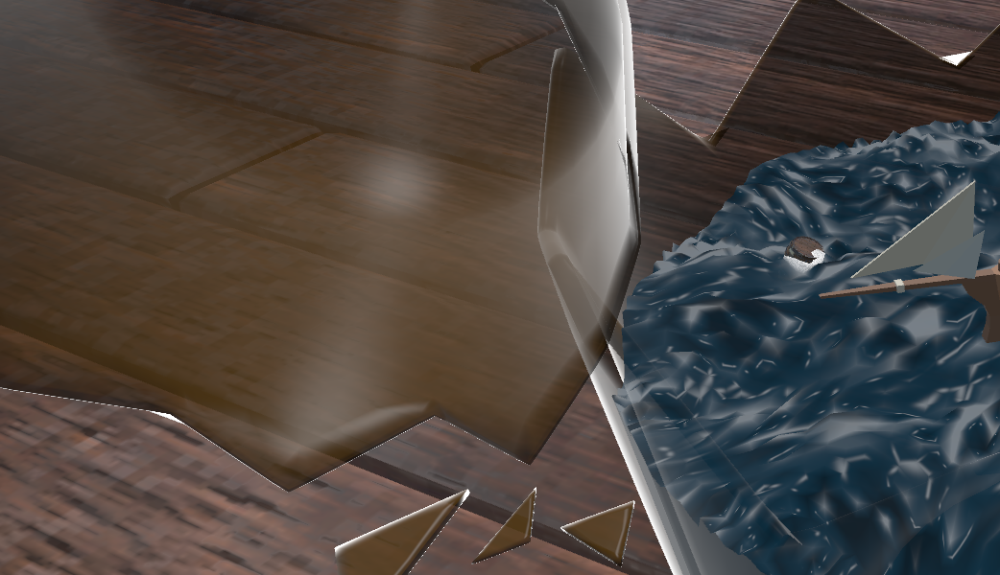

# Ship in a Bottle – Shader Project

## Project Description

This is my shader project for the Computer Graphics lecture. The scene shows a "ship in a bottle" – a small sailing ship sitting on animated water inside a broken glass bottle on a wooden floor. Everything is rendered using custom HLSL shaders in Unity's Built-In Render Pipeline (Unity 2022.3 LTS).

## What I Wanted to Achieve

- A stylized mini ocean with animated waves inside a glass bottle
- Transparent glass that looks somewhat realistic (Fresnel effect, specular highlights)
- Objects (ship, barrels) that float on the water and follow the waves
- Foam where the water meets objects (depth-based intersection foam)
- UI sliders to adjust wave speed, frequency, and amplitude at runtime

## Problems and Solutions

### Water Waves Along the Glass

The original plan was to have the bottle lying on its side, with the water sloshing horizontally. However, making the water deform along the curved glass walls turned out to be really difficult – the waves would clip through the glass or not follow the shape properly. As the professor also pointed out during the presentation, this is a hard problem.

**Solution:** I changed the setup so the bottle stands upright. This way the water surface is always a horizontal plane, and the waves just need to move up and down. Much simpler and it still looks good.

### Transparent Sorting

Glass is transparent, and transparent objects need to be rendered in the right order (back-to-front). With a broken bottle that has many overlapping glass fragments, this causes visible sorting artifacts.

**Solution:** For the water, I used a two-pass approach: a depth prepass that writes to the depth buffer without drawing any color, and a color pass with `ZTest Equal` that only draws where the depth matches exactly. This avoids the typical transparent sorting issues. For the glass pieces, I used a standard alpha blending approach with `ZWrite Off` (same as Exercise 3).

### Floating Objects on the Water

The water waves are calculated in the shader (GPU), but the ship and barrels need to follow those waves from C# (CPU). If the wave math doesn't match exactly, objects sink through or hover above the water.

**Solution:** I duplicated the wave calculation from the shader into `WaterBob.cs` (C# script), making sure the math is identical – same seed, same frequencies, same amplitudes. The script also reads the material properties, so when you change the wave parameters via the UI sliders, everything stays in sync.

### Foam at Object Intersections

I wanted foam where the water touches objects (like the boat hull or the barrels). Simple approaches like world-space distance didn't work well because they don't account for the viewing angle.

**Solution:** Depth-buffer comparison – the shader compares the scene depth (from `_CameraDepthTexture`) with the water surface depth. Where the difference is small, there's geometry close to the water surface, and that's where foam appears. This is similar to how soft particles work. A noise function adds some randomness so the foam doesn't look like a solid line.

## Shader Techniques Used

### Water Shader (`Water.shader`)

- **Vertex displacement:** 4 layered sine waves with different directions/frequencies move the vertices up and down. Different amplitudes and phase offsets create a more organic look.
- **Analytical normals:** Instead of storing normals in a texture, the shader calculates them by sampling the wave height at neighboring positions (finite differences) – same idea as the height-based normals from Exercise 1.
- **Two-pass rendering:** Depth prepass + color pass with ZTest Equal. This lets the water write to the depth buffer (needed for the foam) while still supporting alpha blending for the water surface itself.
- **Depth-based foam:** Compares scene depth vs. water depth using `_CameraDepthTexture`. A noise function makes the foam edge look natural.
- **Fresnel + Specular:** Edges of the water are brighter (Fresnel), and there are specular highlights from the directional light (same approach as Exercise 2).

### Glass Shader (`Glass.shader`)

- **Fresnel transparency:** The glass is mostly transparent in the center and more opaque/bright at the edges, which is how real glass behaves. Uses the `(1 - dot(N,V))^power` formula from the exercises.
- **Blinn-Phong specular:** Specular highlight using the half-vector approach (same as Exercise 2).
- **Alpha blending:** Standard `SrcAlpha OneMinusSrcAlpha` blending with `ZWrite Off`, same as Exercise 3.

## Scripts

- **`Water_Bob.cs`** – Mirrors the shader's wave math on the CPU so objects float correctly.
- **`Water_UI_Controller.cs`** – Connects UI sliders to the water material properties and syncs them with the Water_Bob scripts.
- **`Depth_Texture_Mode.cs`** – Enables the depth texture on the camera, which is needed for the foam depth comparison.

## How to Run

1. Open the project in Unity 2022.3 LTS
2. Open the scene `Assets/Scenes/Bottle_Ship.unity`
3. Press Play – use the sliders in the top-right corner to adjust the wave parameters

## Usage of AI

AI was used as a support tool in this project – specifically for easier documentation, for code completion, and for Unity concepts I was not familiar with (such as the C# scripts for bobbing and UI control). The shader logic and techniques were developed based on the lecture exercises and course material.
